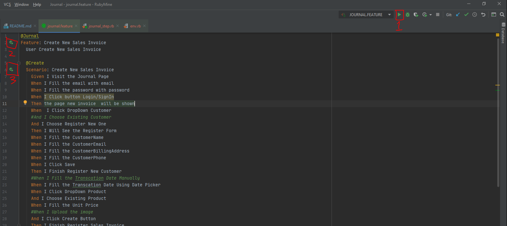

# Journal
Understanding About Cucumber , Selenium and Capybara

## Structure Tree
```bash
├── Gemfile
├── Gemfile.lock
└── features
    ├── journal.feature
    ├── support 
    │   └── env.rb
    └── step_definitions
        └── journal_step.rb
```

## How To Use
Cloning
```
git clone https://github.com/PwS/Journal.git
cd Journal
```

Install bundler
```
gem install bundler
```

Install dependencies Project
```
bundle install
```
Running
```
bundle exec cucumber
```

For Ide RubyMine , Have Button to Running each Feature / Scenario
1. Run Feature (Shortcut Shift + F10)
2. Run Feature
3. Run Scenario

